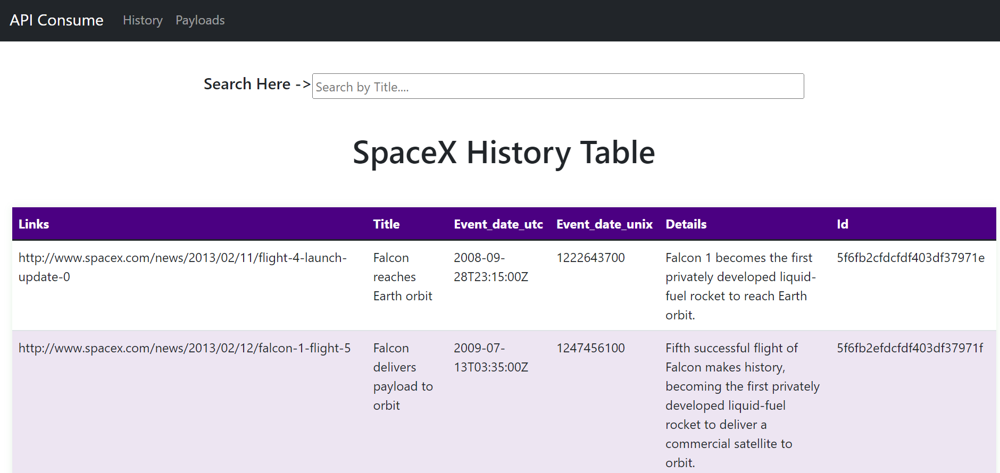
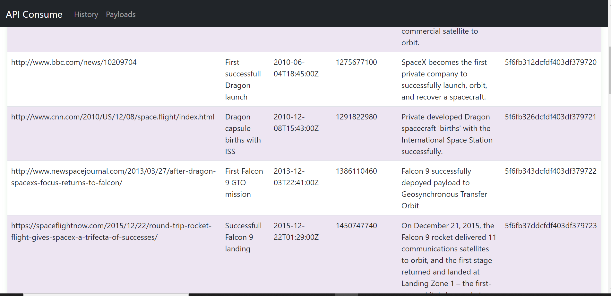
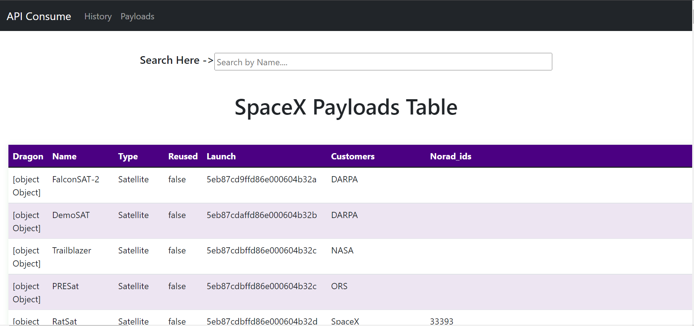
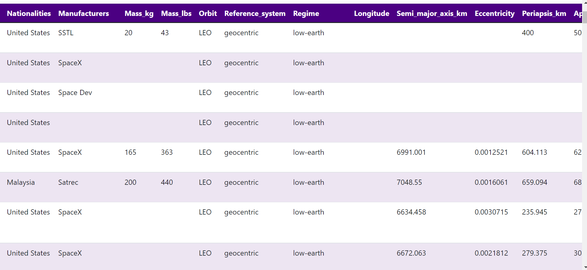

# API-Consume
API consuming SpaceX APIs of their History and Payloads and displaying them in a table. Also giving search option to user who can search by title or name.

### Live demo here:
 [Live Demo](https://ritesh2408.github.io/API-Consume/)

### Web APIs used to fetch data
- [History](https://api.spacexdata.com/latest/history)
- [Payloads](https://api.spacexdata.com/latest/payloads)

### How the Table look like after fetching the above Json 
- #### History

    - 
    - 
- #### Payload
    - 
    - 

### Technologies Used
- HTML
- CSS
- BOOTSTRAP
- JAVASCRIPT
